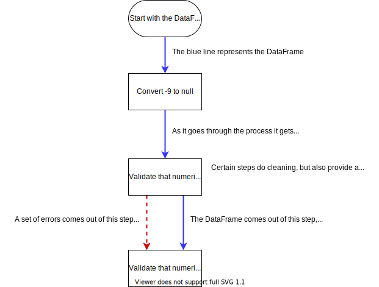

# DFWithErrors

We have introduced a new class to help us with doing the cleaning and preprocessing process.

This class is inspired by the Monad design pattern, you can watch a video on it here: https://www.youtube.com/watch?v=C2w45qRc3aU

The cleaning and processing process looks like this

To keep the errors moving forward, you had to mess about with a bunch of lists. There were a load of `list.append` and `list.extend` statements everywhere. It was messy, it was a bit repetitive, and all the stuff with lists distracts the reader from understanding the main point of the code.
